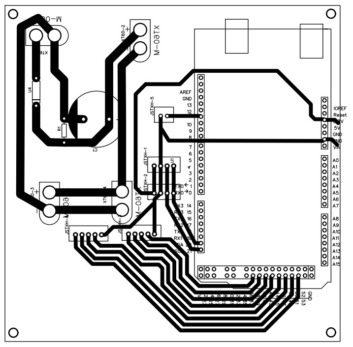
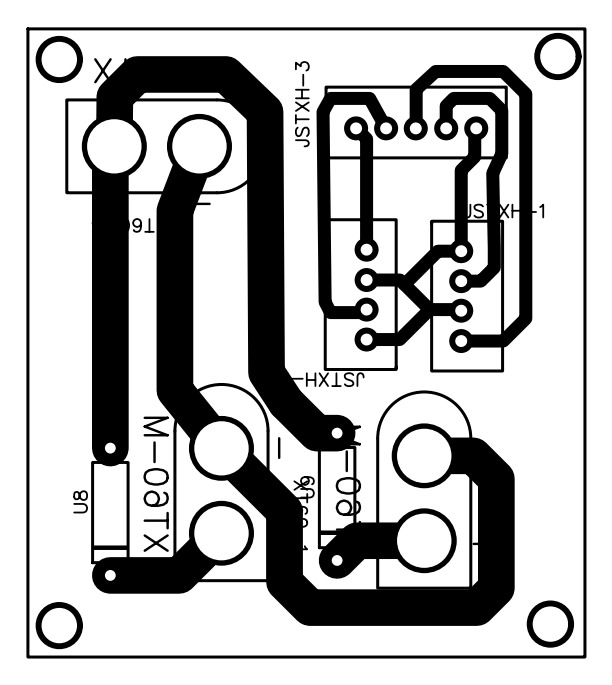
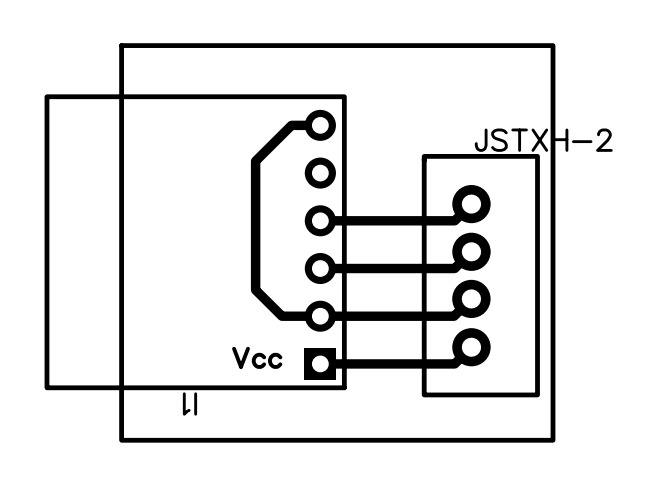
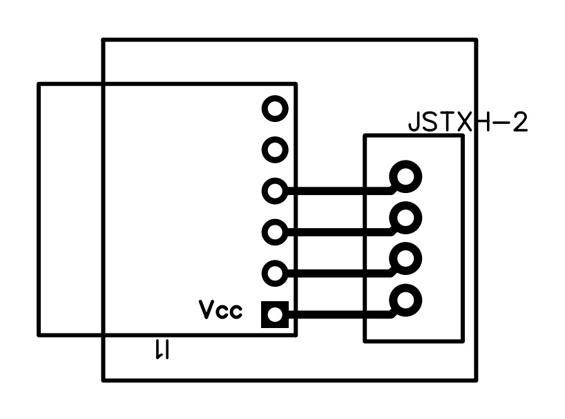

# ⚒️ Assembly

<div style="text-align: justify;">


This section describes the assembly process of the MICKY robot, including mechanical construction, PCB fabrication, and electronic integration.

---

## Mechanical Assembly

This section shows the mechanical assembly of the MICKY robot.

<iframe width="800" height="600" 
    src="https://www.youtube.com/embed/L_kPBL3wr8g"
    frameborder="0" 
    allowfullscreen>
</iframe>

---

## Electronics Assembly

This section describes the electrical assembly of the robot, including PCB fabrication, wiring, and integration of electronic components.

### PCB Fabrication

This section describes the process used to manufacture the custom Printed Circuit Boards (PCBs) developed for the MICKY robot. The boards were produced using a low-cost and accessible method, allowing easy replication without specialized equipment.

### Required Materials

- Copper-clad board  
- Photographic paper  
- Ferric chloride solution  
- Any heat-generating surface  
- Permanent marker  

### Fabrication Process

1. **Print the PCB layout**  
   Print the PCB design at a 1:1 scale on photographic paper.

2. **Transfer the layout**  
   Place the printed layout face-down on the copper board.  
   Apply heat and pressure using an iron to transfer the ink onto the copper surface.

3. **Remove the paper**  
   Carefully remove the photographic paper using a gentle stream of water.  

4. **Fix imperfections**  
   Use a permanent marker to correct any broken traces.

5. **Etching process**  
   Submerge the board in ferric chloride solution to remove the exposed copper.

6. **Cleaning and finishing**  
   Clean and sand the board to remove the ink.  
   The PCB is now ready for soldering.

---

### Custom Boards

These custom boards were designed to simplify system integration and ensure reliable power distribution and signal connectivity across the platform. Each board targets a specific subsystem, contributing to a modular and easily maintainable architecture.

#### Arduino Interface Board

- Arduino Mega 2560  
- Capacitor (63 V / 4700 µF)  
- Resistor (3.3 kΩ)  
- 20 A diode  
- XT60 connectors (4x)  
- JST-XH 5-pin connectors (2x)  
- JST-XH 4-pin connectors (2x)  
- JST-XH 2-pin connector  



---

#### Motor Driver Board

- 20 A diodes (2x)  
- XT60 connectors (3x)  
  - 1x male  
  - 2x female  
- JST-XH 5-pin connector  
- JST-XH 4-pin connectors (2x)  



---

#### IMU Board

- JST-XH 4-pin connector  
- MPU9250 IMU  

<div align="center">


</div>

To support the use of two IMUs in the system, both PCBs were designed to simplify their integration with the rest of the electronics. However, since both sensors share the same communication bus, it is necessary to differentiate them through I2C addressing.

This is achieved by modifying the AD0 pin configuration: one of the IMU boards includes an external trace connecting the AD0 pin to GND, changing its I2C address, while the other maintains the default internal configuration.

---

```{important}
Ferric chloride is corrosive. Always use protective equipment and work in a ventilated environment.
```

</div>